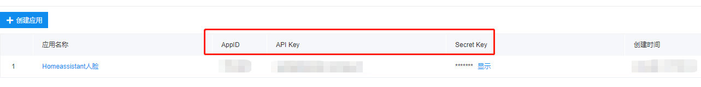
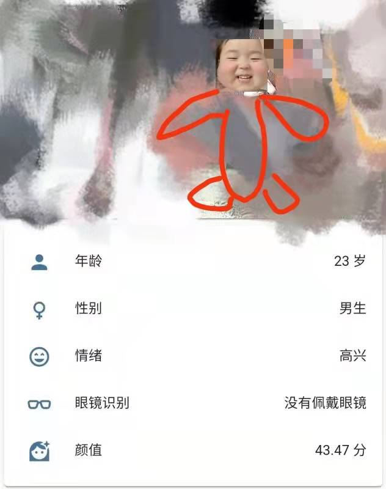

# 百度人脸检测插件v1.0
[](https://www.home-assistant.io/)
[](https://github.com/hacs/integration)


# 更新时间：2022/1/18


# 提前告知  本应用需要有摄像头

## 使用方法：

- 第一步，在HomeAssistant根目录中建立以下文件夹
```
mkdir custom_components
```
- 第二步，将face_detect文件夹放入custom_components文件夹中 
- **第三步，重启HomeAssistant 否则无法配置configuration.yaml，会提示找不到集成**
- 第四步，前往[百度AI开放平台创建人脸识别应用](https://console.bce.baidu.com/ai/?fromai=1#/ai/face/overview/index)，本应用需要用到appid，apikey，secretkey
 
 
- 第五步，在HA中创建一个令牌
- 第六步，填写好configuration.yaml的内容
- 第七步，添加实体到概览上即可

## configuration.yaml内容如下

``` yaml
sensor:
  - platform: face_detect
    app_id: "*****"  #百度人脸识别应用的appid
    api_key: "*****" #百度人脸识别应用的apikey
    secret_key: "*****" #百度人脸识别应用的secret_key
    entity_id: "*****" #摄像头的实体id
    access_token: "*****" #Homeassistant的令牌
    host: "*****" #运行Homeassistant的ip地址
    port: "*****" #运行Homeassistant的端口
    options: #可选识别的类型，可选一个或者多个，我的效果图中没有表情，表示我没有选择这一项
      - age #年龄
      - beauty #颜值打分
      - emotion #情绪
      - gender #性别
      - glasses #佩戴眼镜识别
      - expression #表情
```

**一些提示**

```
#可能有人不知道摄像头id是怎么填写，比如我们家摄像头的配置是这样的，那么entity_id会生成为camera.camera001，填入这个即可
camera:
  - platform: ffmpeg
    name: camera001
    input: rtsp://账号:密码@192.168.31.68:554/ISAPI/Streaming/Channels/101
```
## 效果示意图

很丑，厚码了~😭
## 说明
1. 只能识别一个人，百度其实是可以设置多人的，你可以根据自己改，本程序遇到多个人会识别面积最大的那个人
2. 后期可能加上保存图片，目前没啥时间，赶着写论文

## 参考
刚入坑HomeAssistant不到一个月，有些地方还不是太熟悉，本程序可能有bug，请及时告诉我，大家一起测试，另外非常感谢下面的链接！！

1.[百度人脸识别接口](https://ai.baidu.com/ai-doc/FACE/ek37c1qiz)

2.学习了[和风天气插件](https://github.com/morestart/HeWeather)作者的写法

3.学习了[百度检测插件](https://github.com/Caffreyfans/baidu_face)作者的写法
