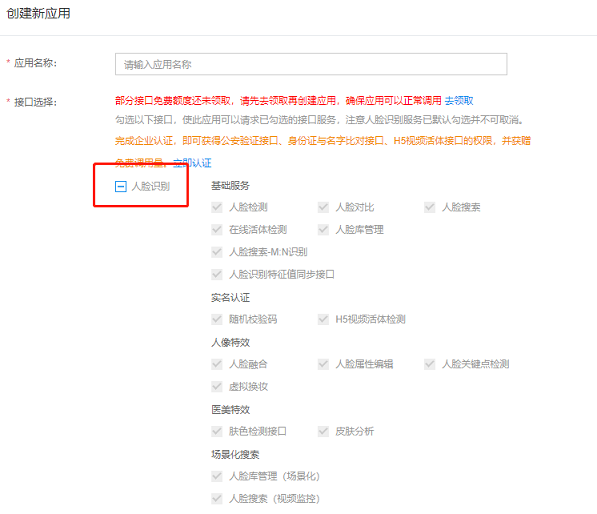
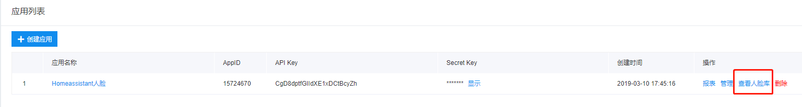
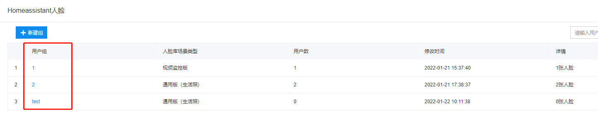
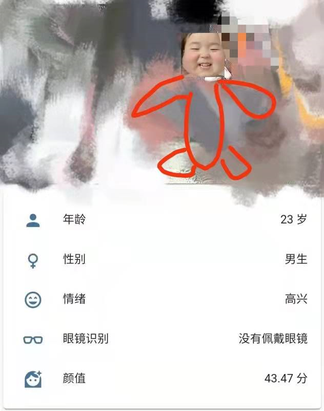
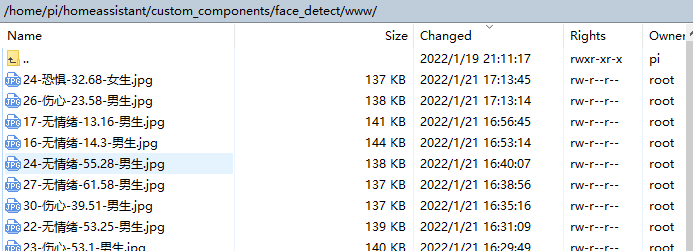
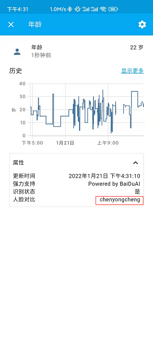

# HomeAssistant百度人脸识别插件v2.1.2

[](https://www.home-assistant.io/)
[](https://github.com/chenwingsing/ha_face_detect)


# 更新时间：2022/2/7[更新README关于人脸识别返回223202的错误原因，人脸识别一直为无的也请点击这里](#322-点进去人脸库后可以创建用户组)  如果你是旧版本的，可以重新下载安装配置

# 1. 功能特性

## v1.0.0（基础人脸检测功能）

- 利用摄像头拍取的图片上传到百度云端自动识别年龄，情绪，性别，佩戴眼镜与否，表情，颜值打分(每隔一秒自动抓拍一张上传)
- 检测到人脸(也许会误判)时会自动保存截图在face_detect/www文件夹中，图片命名为:时间---颜值打分.jpg 

## v2.0.0（联动可玩性增强，人脸搜索功能安排上）

- 新增传感器识别"脸型"
- 新增属性"识别状态"，"人脸对比"
- 修复传感器情绪状态为"grimace"不显示中文的bug
- 保存截图命名修改为："年龄-情绪-颜值打分-性别.jpg"

## v2.0.1

- 紧急修复用https登录的用户无法使用插件的问题

## v2.1.0

- 增加定时清理功能，及时清理保存的截图

## v2.1.1

- 属性"人脸对比"修改为"人脸识别"
- 新增传感器"人脸识别"(注意配置文件有变化)

## v2.1.2

- 修复传感器情绪状态为"pouty"不显示中文的bug
- 修复一个可能引起实体不可使用的bug

# 2. 使用方法：

- 第一步，在HomeAssistant根目录中建立文件夹custom_components
  
  ```
  mkdir custom_components #linux
  ```

- 第二步，将face_detect文件夹放入custom_components文件夹中 

- **第三步，重启HomeAssistant，否则无法配置configuration.yaml，会提示找不到集成**

- 第四步，前往[百度AI开放平台创建人脸识别应用](https://console.bce.baidu.com/ai/?fromai=1#/ai/face/overview/index)，本应用需要用到appid，apikey，secretkey
  
  

- 第五步，在HA中创建一个令牌

- 第六步，填写好configuration.yaml的内容，然后再重启一次HomeAssistant

- 第七步，添加实体到概览上即可

# 3. configuration.yaml内容如下
请注意下面只需要修改引号内的内容，不要把引号给删除了！！！
```yaml
sensor:
  - platform: face_detect
    app_id: "*****"  #百度人脸识别应用的appid，必填项目
    api_key: "*****" #百度人脸识别应用的apikey，必填项目
    secret_key: "*****" #百度人脸识别应用的secret_key，必填项目
    entity_id: "*****" #摄像头的实体id，必填项目
    access_token: "*****" #Homeassistant的令牌，必填项目
    host: "*****" #运行Homeassistant的ip地址，必填项目，如192.168.31.134
    port: "*****" #运行Homeassistant的端口，必填项目，如8123
    group_list: "**,**,**" #百度应用内的查看人脸库用户组编号，这里表示有三个用户组，最多可以填10个，请用英文逗号隔开，如果只设置一个用户组，请把其他**去掉。
    scan_interval: 1 #扫描时间，默认这个即可
    delete_time: "60" #设置定时清理截图文件，单位为秒，这里表示及时清理60秒之前的文件，如果是1小时，则填3600
    options: #可选识别的类型，可选一个或者多个。
      - age #年龄
      - beauty #颜值打分
      - emotion #情绪
      - gender #性别
      - glasses #佩戴眼镜识别
      - expression #表情
      - faceshape #脸型识别
      - facerecognition #人脸识别（需要设置group_list同时在百度应用上传人脸）
```

## 3.1 entity_id怎么获取？

```
#可能有人不知道摄像头id是怎么填写，比如我们家摄像头的配置是这样的，那么entity_id会生成为camera.camera001，填入这个即可
camera:
  - platform: ffmpeg
    name: camera001
    input: rtsp://账号:密码@192.168.31.68:554/ISAPI/Streaming/Channels/101
```

## 3.2 group_list怎么获取？(可以不用这个功能，直接默认参数即可，但是不能删除这个配置)

### 3.2.1 在百度上创建好人脸识别应用后，管理应用中有一个查看人脸库



### 3.2.2 点进去人脸库后可以创建用户组



如图所示，我一共创建了3个用户组，分别是1,2,test，**需要注意的我们看到人脸库场景类型有视频监控版和通用版(生活照)，如果填写了视频监控版的序号貌似会返回223202错误，目前还没找到百度的具体解释，所以你最好只创建通用版(生活照)这种场景，比如我这个就需要在配置中填写group_list:"2,test"，切记不能把1也填上去，还有需要注意最多能填写10个** 

### 3.2.3 在用户组中创建你的人脸


如图所示，我在用户组2中创建了两个人脸id，一个是chenyongcheng，一个是xiaoliu，也就是对应两个人的人脸，每个id可以上传多张照片，这样识别准确率更高。

# 4.效果示意图

**总体来说，本程序调用了百度的两个功能，一个是人脸检测功能，一个是人脸搜索功能，人脸检测可以用于监控陌生人路过，而人脸识别可以用于家庭中识别人脸，进而可以触发一些有趣的效果，比如识别到不同家庭用户的脸，可以联动小爱同学发出不同的语音效果**。

## 4.1 人脸检测功能

很丑，厚码了~😭



云端识别到有人脸会自动保存信息



## 4.2 人脸识别功能（需要在百度应用中上传人脸库，同时配置group_list）

如果人脸对比成功后，会在属性中显示你的百度中设置的id，注意，不只是在年龄这个传感器中有，我在每个传感器中都配置了这个属性，你在自动化联动的时候，可以任意选择其中一个传感器。



## 5. 实体信息说明

## 5.1 实体可能出现的所有状态信息

| 实体名称 | 状态                              | 备注                                                                   |
|:----:|:-------------------------------:|:--------------------------------------------------------------------:|
| 年龄   | ~岁                              |                                                                      |
| 性别   | 男生\|女生                          |                                                                      |
| 情绪   | 愤怒\|厌恶\|恐惧\|高兴\|伤心\|惊讶\|无情绪\|鬼脸\|翘嘴  |                                                                      |
| 颜值   | ~分                              | 0~100分，越高分表示颜值越高                                                     |
| 表情   | 没有微笑\|微笑\|大笑                    |                                                                      |
| 脸型   | 正方形脸\|三角形脸\|椭圆脸\|心型脸\|圆型脸       |                                                                      |
| 眼镜识别 | 没有佩戴眼镜\|普通眼镜\|墨镜                |                                                                      |
| 人脸识别 | 无\|返回人脸库的id                     | 若和你人脸库的对比成功，则返回你在百度人脸库中的id，与属性的人脸识别展示效果一样，设置属性是为了方便联动其他设备，传感器是为了展示状态 |

## 5.2 每个实体具备的属性

| 属性名称 | 属性值                            | 备注                                              |
|:----:|:------------------------------:|:-----------------------------------------------:|
| 更新时间 | xxxx年xx月xx日 上/下 午 xx : xx : xx | 调用百度api后返回实时时间，程序设置的是每1秒调用一次，实际上会有延迟            |
| 强力支持 | Powered by BaiDuAI             | 致敬百度AI                                          |
| 识别状态 | 是\|否                           | 可以用于进行联动，当识别到人脸则会返回是，否则返回否，利用这个特性你可以进行报警自动化联动功能 |
| 人脸识别 | 无\|返回人脸库的id                    | 若和你人脸库的对比成功，则返回你在百度人脸库中的id                      |

## 

# 6. 提供一些玩法思路

**本次更新最大的特点就是增加联动性**

## 6.1 外出启动监控场景

比如你现在出门了，需要对家里进行监控，一旦有人出现，小爱音箱就会发出声音：小贼哪里跑，思路则是，当传感器(任何一个均可)的"识别状态""从“否”变成“是”后就触发小爱音箱的语音功能，那么你的自动化设置可以为：

```
alias: 抓贼专用
description: ''
trigger:
  - platform: state
    entity_id: sensor.xing_bie 
    attribute: 识别状态
    from: 否
    to: 是
condition: []
action:
  - service: xiaomi_miot_raw.speak_text
    data:
      entity_id: media_player.s12_cloud_111671
      text: 小贼哪里跑！！！！！
mode: single
```

## 6.2 个性化欢迎(配合人脸对比)

不同家庭成员回家，让小爱音箱用不同的欢迎词，实现个性化，那么你的思路就是，当传感器的"人脸对比"从"无"变成"你在百度上设置的用户id"，那么就触发相应动作：

```
alias: 欢迎小陈回家
description: ''
trigger:
  - platform: state
    entity_id: sensor.xing_bie
    attribute: 人脸对比
    from: 无
    to: chenyongcheng
condition: []
action:
  - service: xiaomi_miot_raw.speak_text
    data:
      text: 小陈你好呀
      entity_id: media_player.s12_cloud_111671
mode: single
```

更多其他玩法，发挥你的想象力！

**这里说明一点：识别状态和人脸对比这两个属性是每次调用百度API后就会改变，也就是和更新时间一样，而传感器的状态(如年龄，情绪，脸型状态)则是触发下一次识别到人脸才会改变哦。**

# 7. 说明

1. 为了方便设置传感器状态，本程序设置为只能识别一个人，百度其实是可以设置多人的，动手能力强的你可以自己修改程序。

# 8. 扩展

如果你刚刚入坑HomeAssistant，可以看看我知乎的文章~

- [树莓派HomeAssistant系列（零）Docker安装](https://zhuanlan.zhihu.com/p/452889766)

- [树莓派HomeAssistant系列（一）外网远程访问控制(免费)（内有Homekit在Docker下未找到配件的原因）](https://zhuanlan.zhihu.com/p/452676882)

- [树莓派HomeAssistant系列（二）MQTT监控你的树莓派](https://zhuanlan.zhihu.com/p/452896841)

- [树莓派HomeAssistant系列（三）天气，邮箱，RSS订阅，自动化(每日天气邮件提醒，RSS通知)](https://zhuanlan.zhihu.com/p/454729756)

- [树莓派HomeAssistant系列（四）NodeRed安装配置](https://zhuanlan.zhihu.com/p/456741817)

- [树莓派HomeAssistant系列（五）警戒设置，企业微信推送，文件管理，云音乐](https://zhuanlan.zhihu.com/p/457832259)

- [树莓派HomeAssistant系列（六）海康威视摄像头接入零延时+摄像头截图（附海康威视RTSP设置）](https://zhuanlan.zhihu.com/p/458155266)

- [树莓派HomeAssistant系列（七）普通摄像头赋能百度AI人脸检测](https://zhuanlan.zhihu.com/p/459588910)

# 9. 参考

刚入坑HomeAssistant不到一个月，有些地方还不是太熟悉，本程序可能有bug，请及时告诉我，大家一起测试，另外非常感谢下面的链接！！

1.[百度人脸识别接口](https://ai.baidu.com/ai-doc/FACE/ek37c1qiz)

2.学习了[和风天气插件](https://github.com/morestart/HeWeather)作者的写法

3.学习了[百度检测插件](https://github.com/Caffreyfans/baidu_face)作者的写法
